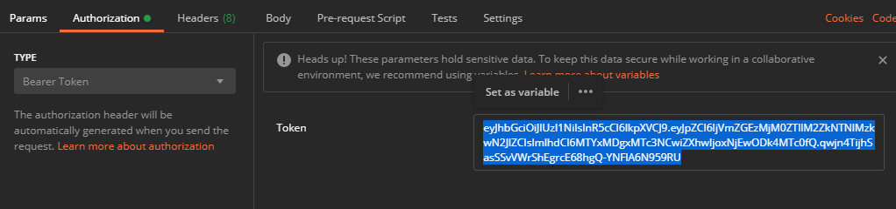

<h1 align="center">BooksAuth 👨🏻‍💻 </h1>

  
  

Proyecto para introducir la autenticación y autorización en el proyecto de Books.

## Authors
👤 **JuanCBM**: Juan Carlos Blázquez Muñoz
* Github: [@JuanCBM](https://github.com/JuanCBM)

👤 **mahuerta**: Miguel Ángel Huerta Rodríguez
* Github: [@mahuerta](https://github.com/mahuerta)

# Sobre la entrega:

En la solución de Java, hemos utilizado el código que generamos en la entrega 2.

En la parte de Node, nos hemos basado en la solución facilitada por el profesor de la entrega 2.

Hemos cambiado la forma de enviar el token en la parte de NODE para que fuera exactamente igual que la de Java.
Desde el postman sería sin utilizar la cabecera 'x-access-token', utilizamos la por defecto 'Authorization':

# Ejecución de la aplicación:
**1.** Primero debemos ejecutar los comandos docker para disponer de las diferentes BBDD. Hemos preparado un script para poder ejecutarlo de forma más comoda:
> node exec_dockers.js

**2.** Situándonos en la carpeta del proyecto, ejecutamos el comando que permitirá la instalación de las dependencias de todos los proyectos
> node install.js

**3.** Finalmente, en la misma carpeta del proyecto, ejecutamos el comando que permitirá la ejecución de los diferentes servicios
> node exec.js

## Apuntes teóricos
### Https en Spring
- Ejecutando como administrador una terminal, en el directorio:
> C:\Program Files\Java\jdk-11.0.5\bin

- Ejecutamos el comando y tras rellenar el formulario generará el archivo necesario ('keystore.jks')
> keytool -genkey -keyalg RSA -alias selfsigned -keystore keystore.jks -storepass password -validity 360 -keysize 2048

### Https en node
Git incorpora OpenSSL.
- Ejecutando como administrador una terminal, en el directorio:  
> C:\Program Files\Git\usr\bin\openssl.exe

- Ejecutamos el comando
> openssl.exe
 
- En su interior, con el comando y tras rellenar el formulario generará los dos archivos necesarios en proyecto node para https ('server.cert' y 'server.key')
> req -nodes -new -x509 -keyout server.key -out server.cert

